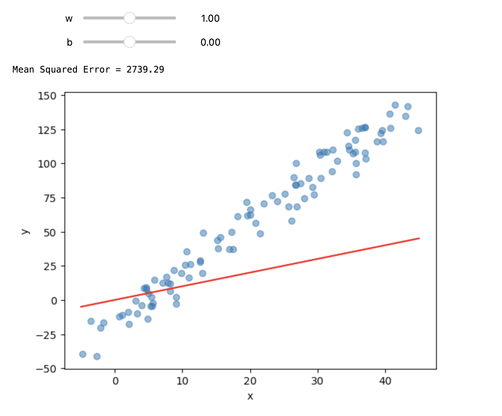
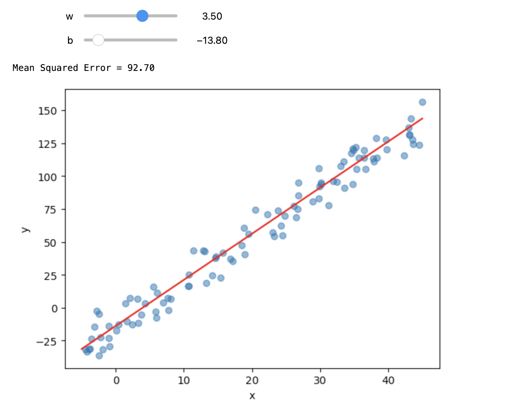
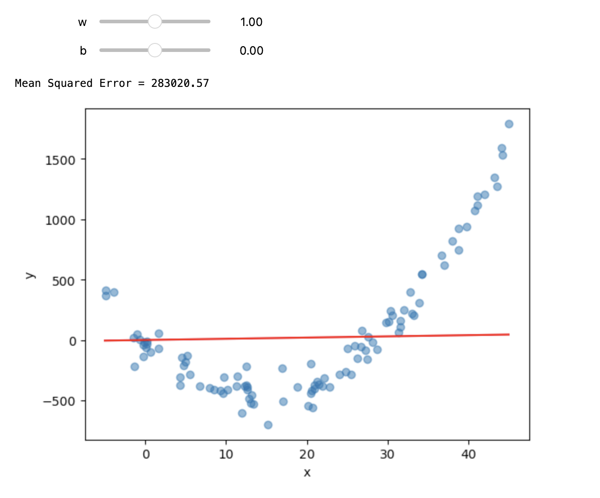
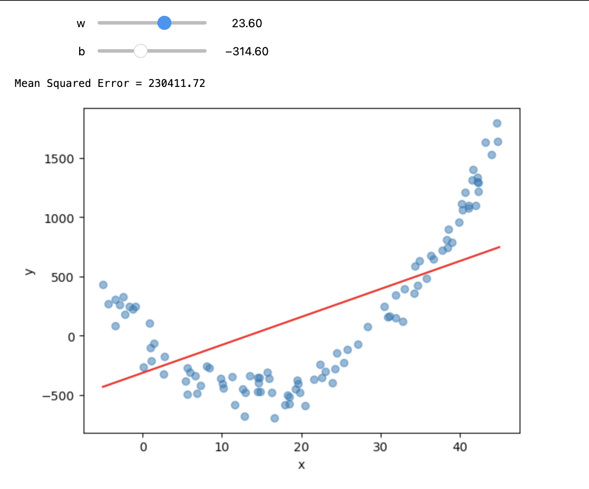
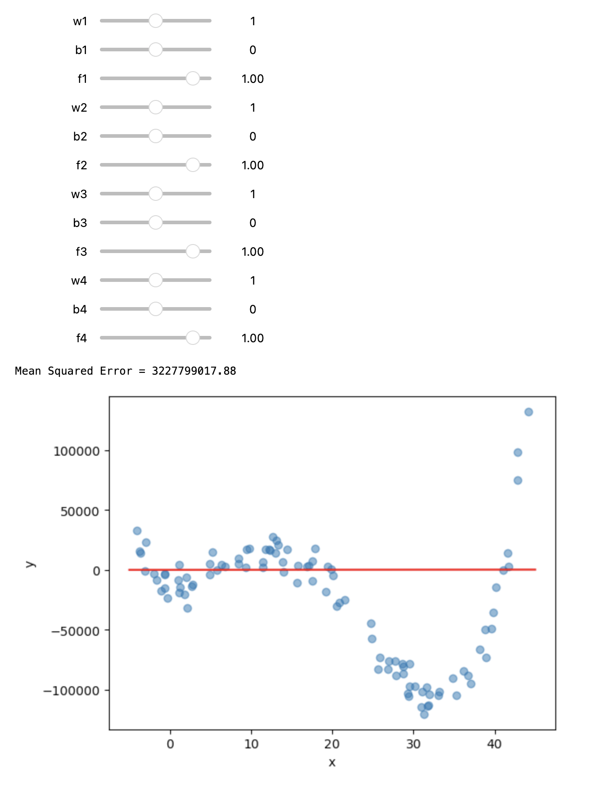
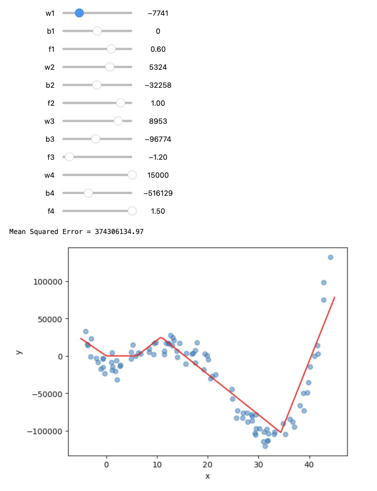

# HHS CS Workshop: Neural Networks
Learn about neural networks through manually adjusting perceptron weights and biases.  
[Workshop slides](https://github.com/BaroqueObama/hhs-ws-neural-networks-1/blob/main/GM3.pdf)  
## Code:
- `generateData`: Generate random synthetic data based on some function.
- `plotf`: Plots a function onto matplotlib plot.
- `wrap`: Wrapper function which takes in parameters of a function and returns a function with those parameters. (Used so that users can adjust function parameters manually with widgets.)
- `ipywidgets`: Interactive widgets members can use to adjust function parameters in real-time and visually. 
## Activity:
### Activity 1
Adjust the interactive widgets to fit the function/model to the data.  
**Fitting a Simple Linear Regression Model on Linear Data**  

  
  

**Fitting a Simple Linear Regression Model on Non-Linear Data**  

  
  

(Notice that a linear model cannot fit non-linear data well.)  
### Activity 2
Multilayer Perceptrons can be used instead. Activation functions (ReLUs in this case) can be used to add non-linearity.  
Structure of MLP:  
  
**Fitting an MLP with 1 Hidden layer with 4 Perceptrons on Non-Linear Data**  

  
  

